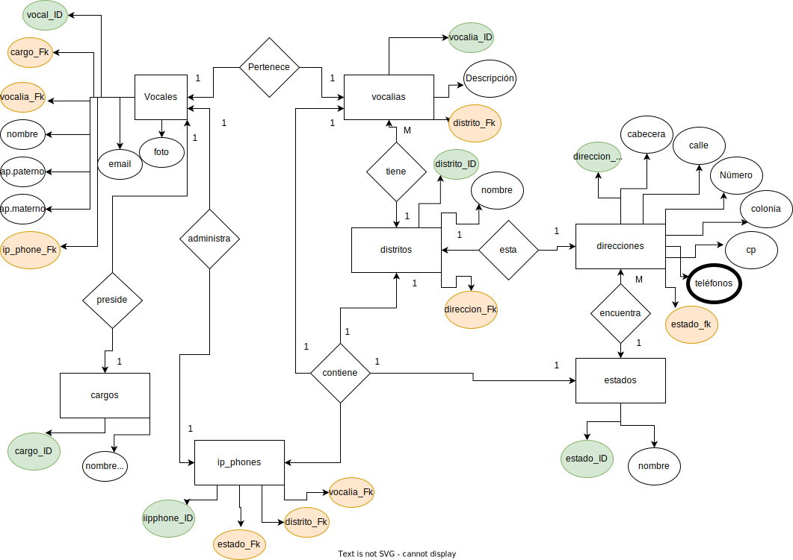

## Modelado de Datos

1. Identificar las entidades del sistema.
2. Identificar los atributos para cada entidad.
3. Identificar las llaves primarias.
4. Asignar una nomenclatura adecuada a las entidades y sus atributos.
5. Identificar las entidades pivote del sistema.
6. Identificar los catalogos del sistema.
7. Identificar los tipos de relaciones (1 a 1) (1 a M) [(M a N)] --->volver a plantear.
8. Crear modelo Entidad-Relación (ER).
9. Crear Modelo Relacional de la base de datos del sistema.
10. Identificar  los tipos de datos de los atributos de las entidades del sistema. (INT, CHAR, BLOB, FLOAT, DATE, GEO, BOOLEAN, ETC...)
11. Identificar los atributos que puedan ser únicos en el sistema.
12. Identificar las reglas del negocio _(operaciones CRUD)_ del sistema.

## Glosario 

>- **PK**: _PRIMARY KEY_
>- **FK**: _FOREIGN KEY_
>- **UQ**: _UNIQUE ATTRIBUTE_
>- **ED**: _ENTIDAD DE DATOS_
>- **EP**: _ENTIDAD PIVOTE_
>- **EC**: _ENTIDAD CATALOGO_ 

## Modelado de Datos E-R 

Modelo Entidad Relacion 

## Modelo Relacional (MR -> tablas )

> 